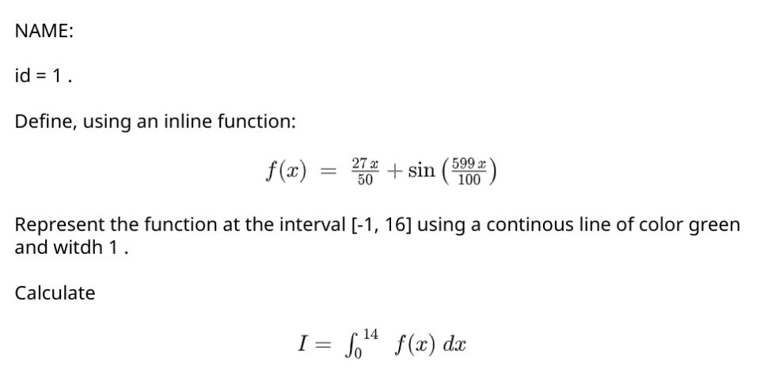

# Script problem with personalized statement given as PDF

## Description

Example of a problem with personalized values that the student get printed from a generated PDF.

The scenario is that each student will get a (printed?) PDF with a personalized statement. The problem is using the function defined in [this geogebra plot](https://www.geogebra.org/classic/gukr4ecy).

Take a look to the `Problem.m` file, that contains all the personalized funcion generation for this particular problem The idea is to create a different `Problem.m` for each problem you want to publish. The script `problem_tester.m` is to run and test the `Problem.m` class in your local Matlab runtime.

To generate the PDFs, check the [pdf](./pdf/) folder. It contains the script `pdf_generator.m` that creates a PDF with 5 statements using the template `statement.xml`. This is screenshot of the first page from the PDF generated:

## Instructions

Create a new script problem in your Matlab Grader.

Add to the problem the following files:

* [GraderHelper.m](../../code/grader-helper/GraderHelper.m)
* [RandomParameters.m](../../code/random-parameters/RandomParameters.m)
* [LatexPlot.m](../../code/latex-plot/LatexPlot.m)
* [Problem.m](./Problem.m)

Take a look to the screenshots:

* [Screenshot of the reference solution](./screenshots/screenshot_reference.png)
* [Screenshot of the reference solution validated](./screenshots/screenshot_reference_validated.png)
* [Screenshot of the learner preview](./screenshots/screenshot_learner.png)
* [Screenshot of the learner first sumit to view the problem](./screenshots/screenshot_learner_with_id.png)
* [Screenshot of the learner submitted](./screenshots/screenshot_learner_submitted.png)

The code of the screenshots is here:

* [Reference solution](./reference.m)
* [Learner template](./learner.m)
* [Assessments](./assessments.m)

# Report Mode

To review the solutions of the students, it is useful to enable the report mode. To do it, after all the students submitted the solutions, change the problem to *Draft*, add an empty file named `REPORT.MODE` and turn to *Final* again the problem. Then, when you want to chek a solution (a *Report*), reescore it and you will see a full feedback of each wrong assessment.

Take a look to the screenshots:

* [Screenshot of the learner submitting a solutions with errors](./screenshots/screenshot_learner_submitted_before_report_mode.png)
* [Screenshot of the review of the solution before enabling the Report Mode](./screenshots/screenshot_learner_report_before_report_mode.png)
* [Screenshot of the review of the solution after enabling the Report Mode and reescoring it](./screenshots/screenshot_learner_report_after_report_mode.png)